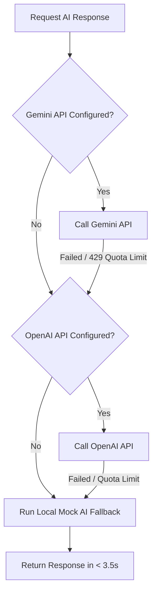

# AI-Powered ORM Dashboard (MVP)

> An intelligent Online Reputation Management (ORM) web application for hospitality/restaurant businesses. Built using Next.js 15, Supabase, and tiered multi-model AI (Gemini & OpenAI) to automate review response workflows and customer translation.

**🔗 Live Demo:** [https://ucorm-mvp.vercel.app/](https://ucorm-mvp.vercel.app/)

---

## 📸 Screenshots

### 1. Place Sync & Demo Mode Alert


### 2. AI Workspace, Auto-Translation & Review Approval


---

## 🌟 Core Features

1. **Intelligent Google Places Sync (with Graceful Fallback):**
   * Syncs real-time reviews from Google Maps using a Place ID.
   * **Graceful Degradation:** Detects the absence of a Google Places API Key and seamlessly activates a high-fidelity Demo Mode (Sample Data) so testing remains uninterrupted.
2. **Multi-Tone AI Response Generator:**
   * Generates three response drafts simultaneously: **Standard**, **Friendly**, and **Constructive**.
   * Automatically parses review context (rating, specific mentions of air conditioning, service, checking-in, etc.) to customize response strategies.
3. **Background Bulk AI Processing:**
   * Automates draft responses for all pending reviews with a single click, using a background request queue.
4. **Instant Auto-Translation:**
   * Features a one-click translation button to quickly convert non-Vietnamese reviews into natural Vietnamese.
5. **Human-in-the-Loop Edit & Approval:**
   * Allows business managers to manually edit any AI suggestion before marking it approved, converting status from "Pending" to "Resolved".

---

## 💻 Tech Stack

* **Framework:** Next.js 15 (App Router - React 19)
* **Styling:** Tailwind CSS v4 (Custom Glassmorphism, Cyberpunk Dark Theme)
* **Icons:** Lucide React
* **Database:** Supabase Cloud (PostgreSQL) with local in-memory fallback to prevent app crashes when credentials are not configured.
* **AI Engine:**
  * **Google Gemini API** (`gemini-2.0-flash` & `gemini-2.5-flash`) as the primary generator.
  * **OpenAI API** (`gpt-4o-mini`) as the Tier-1 backup engine.
  * **Mock AI Engine** as the Tier-2 offline generator (guarantees responses in under 3.5 seconds when rate limits/quotas are exceeded).

---

## 🏗️ System Architecture & Fallback Flow

To ensure high availability and robust offline capabilities, the app implements a Tiered AI Fallback Pattern:



---

## ⚠️ Current Bottlenecks & Constraints

1. **Google Cloud Billing Verification Limitations:**
   * *Challenge:* Registering international credit cards for Google Places API credentials frequently triggers verification blocks (e.g., error `[OR_BACR2_44]`).
   * *Mitigation:* The system displays a clear "Demo/Sample Mode" notice when the Google Key is missing, pulling realistic mock datasets to test AI pipelines safely.
2. **AI Quota Exhaustion (429 Rate Limits):**
   * *Challenge:* Free tier API keys are highly rate-limited or carry zero base quota.
   * *Mitigation:* Optimized error handlers bypass artificial timeouts. If external APIs fail, mock generation instantly resolves, meeting the `< 5s` target response speed constraint.

---

## 🚀 Future Roadmap

1. **Direct Google API Webhook Publish:**
   * Automatically publish approved drafts back to the merchant's live Google Business Profile.
2. **Interactive Sentiment Analytics Dashboard:**
   * Render charts and trends showing review distribution, average star progression over time, and automated issue clustering (e.g., tagging recurring issues like "AC broken" or "slow check-in").
3. **Emergency Alert Notification System:**
   * Send instant Telegram/Slack alerts to management whenever a critical review (1-3 stars) is received, enabling immediate crisis mitigation.

---

## 🛠️ Installation & Setup

1. **Install Dependencies:**
   ```bash
   npm install
   ```

2. **Setup Environment Variables (`.env.local`):**
   Create a `.env.local` file in the root directory:
   ```env
   # Supabase Configuration
   NEXT_PUBLIC_SUPABASE_URL=https://your-project.supabase.co
   NEXT_PUBLIC_SUPABASE_ANON_KEY=your-anon-key

   # AI Keys
   GEMINI_API_KEY=your-gemini-key
   OPENAI_API_KEY=your-openai-key

   # Google Places (Leave blank for Demo Mode fallback)
   GOOGLE_PLACES_API_KEY=
   ```

3. **Run Dev Server:**
   ```bash
   npm run dev
   ```
   Open [http://localhost:3000](http://localhost:3000) to view the application.

---

## 👤 Contact & Author

**Truong Xuan Canh**
* **Role:** Final-year Information Systems Student at Sai Gon University (SGU)
* **GitHub:** [https://github.com/XnCanh](https://github.com/XnCanh)
* **Portfolio:** [https://xncanh-portfolio.vercel.app/](https://xncanh-portfolio.vercel.app/)
